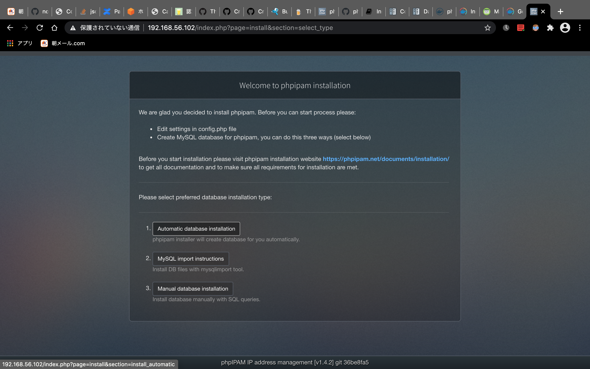
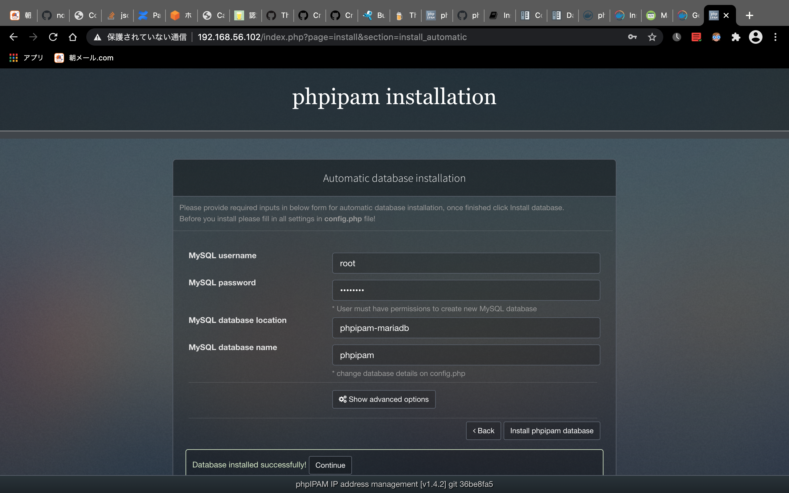
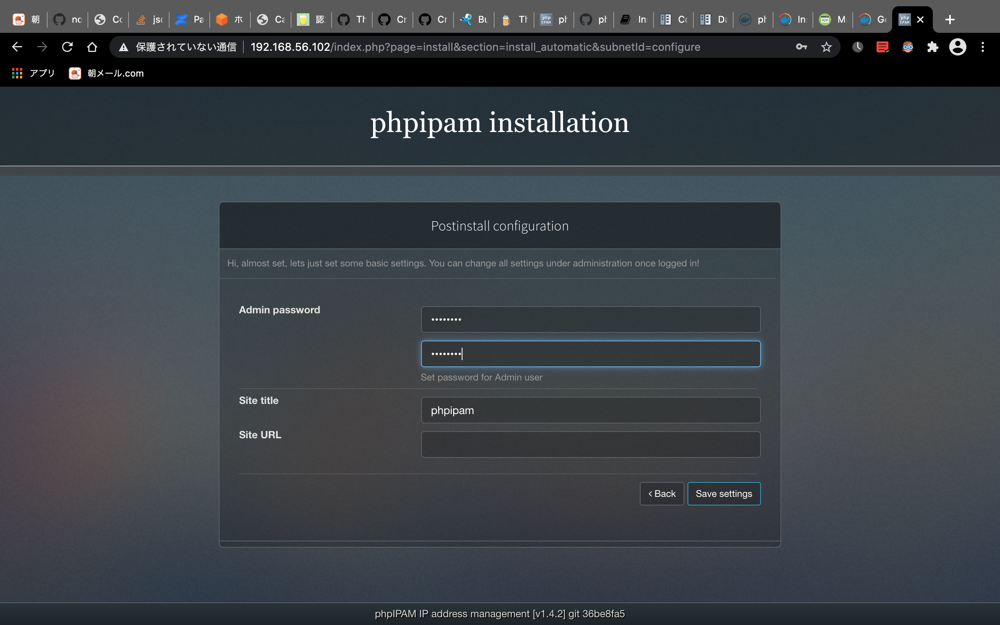
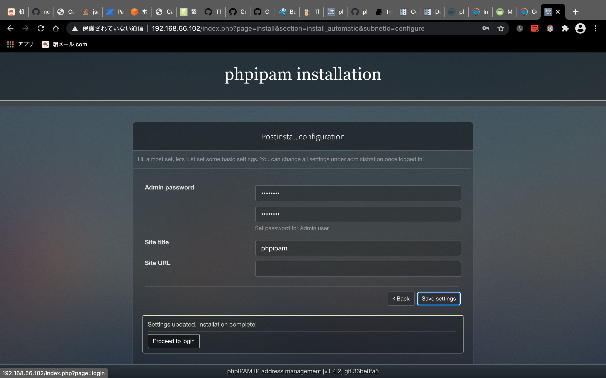
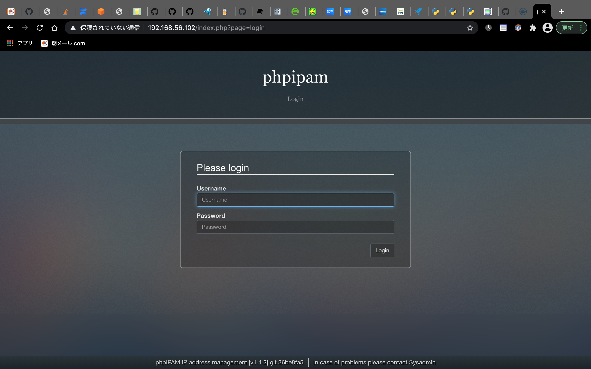
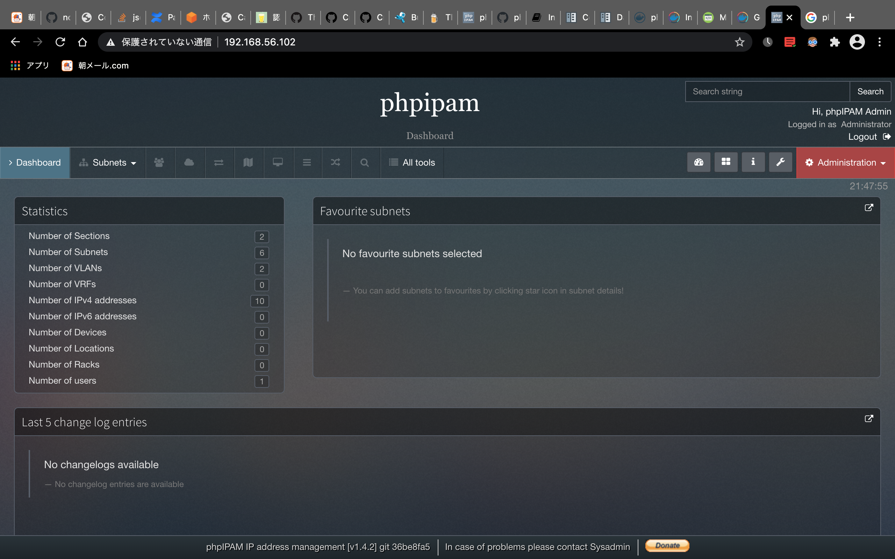

##　実践で学ぶ：docker-composeの定義を読みながらphpipamを配備しよう

### 目的
docker環境でphpipadmを配備する手順を記録します。
業務効率化のため、phpipamのサービスを構築しようと思います。
公式サイトには、手動インストールの手順しか載せていないので、トレントのコンテナで実践したいと考えています。
自習の効果を上げるため、dockerとdocker-hubの正式ドキュメントのみ参照して、実際に実施した履歴をここで
まとめたいと思います。
単に全ての手順を一度実施するだけで、なかなか印象に残らないので、自分がわからない箇所に対して、正式ドキュメントや他のリソースを参照し、必ず理解してから進める方針は大事です。自分の場合は、docker-composeの定義ファイルを初めて見るので、その中の定義を１行ずつでを調べて注釈してみました。このようなやり方は今後の技術勉強の時にも続けていきたいと思います。

全ての記載内容はインターネット接続前提となります。

### 使用するイメージ
- [docker hubに公開されているイメージ](https://hub.docker.com/r/phpipam/phpipam-www)
- phpipam開発元が提供するものなので、信用できると思います。

### Docker実行環境の構築
#### PC環境
- MacBook (Retina, 12-inch, 2017)
- Memory: 8GB

#### 仮想化ソフトウェア
- 自分がいつも使っているオープンソースのVirtualBoxです。

#### VM用OS
- CentOS 7.82003

#### dockerのインストール

- 参考先：https://docs.docker.com/engine/install/centos/

1. 最初にパッケージとリポジトリを最新化します。
```bash
# yum update -y
```

2. docker正式リポジトリの有効化
```bash
# yum install -y yum-utils
# yum-config-manager --add-repo https://download.docker.com/linux/centos/docker-ce.repo
```

3. docker-engineのインストール
```bash
# yum install docker-ce docker-ce-cli containerd.io -y
```

4. dockerサービスの起動
```bash
# systemctl start docker
```

5. 「Hello world」イメージで動作確認を実施
出力内容をよく見ると、「docker run」実施する際の動作シーケンスをだいたい理解できます。１行ずつ見てみましょう。
    1. runの後ろに指定するイメージ名をまずローカルで探してみる
    2. ローカルでイメージを見つからなかったので、「library/hello-world」からイメージをダウンロード(pull操作)
    3. 「Pull complete」でダウンロード完了を示している。「0e03bdcc26d7」の数字は、イメージのレイヤーIDです。場合によって、複数のレイヤーを持つイメージも存在します。マルチレイヤーDVDの感じかな。
    4. 「Digest」というのは、「docker pull」のドキュメントによると、イメージのsha256形式のハッシュ値です。
    5. 「latest」というのは、コマンド実行時にタグを指定しない場合は、自動的に付与されるものです。特別のバージョンを指定する際に使用するパラメータだそうです。
```bash
# docker run hello-world
Unable to find image 'hello-world:latest' locally
latest: Pulling from library/hello-world
0e03bdcc26d7: Pull complete 
Digest: sha256:31b9c7d48790f0d8c50ab433d9c3b7e17666d6993084c002c2ff1ca09b96391d
Status: Downloaded newer image for hello-world:latest

Hello from Docker!
This message shows that your installation appears to be working correctly.

To generate this message, Docker took the following steps:
 1. The Docker client contacted the Docker daemon.
 2. The Docker daemon pulled the "hello-world" image from the Docker Hub.
    (amd64)
 3. The Docker daemon created a new container from that image which runs the
    executable that produces the output you are currently reading.
 4. The Docker daemon streamed that output to the Docker client, which sent it
    to your terminal.

To try something more ambitious, you can run an Ubuntu container with:
 $ docker run -it ubuntu bash

Share images, automate workflows, and more with a free Docker ID:
 https://hub.docker.com/

For more examples and ideas, visit:
 https://docs.docker.com/get-started/
```

6. proxyあり環境の場合は
参照先：https://docs.docker.com/config/daemon/systemd/
```bash
# mkdir -p /etc/systemd/system/docker.service.d
# vi /etc/systemd/system/docker.service.d/http-proxy.conf
# cat /etc/systemd/system/docker.service.d/http-proxy.conf
[Service]
Environment="HTTP_PROXY=http://<ProxyサーバのIP>:<Proxyサーバのポート番号>"
# systemctl daemon-reload
# systemctl restart docker
```
#### docker-hubのイメージを使ってphpipamの配備

- 参照先：https://hub.docker.com/r/phpipam/phpipam-www

- phpipamのテナント構成
phpipamを稼働するためにはウェブアプリとバックエンドのデータベースが必要です。
上記docker-hubページ提供するのは、単一のコンテナを配備する定義ファイルではなく、複数のコンテナをまとめて定義するcompose定義ファイルとなっています。このcompose定義を使用するには、追加でdocker-composeのCLIをインストールする必要があリます。


1. docker-compose.yamlの読解  
上記docker-hubのページには、docker-composeで配備するための定義ファイルが提供されています。
そのまま使用してもいいですが、勉強の意味で定義の内容を具体的に理解した上で実行したいと思います。

```yaml
# WARNING: Replace the example passwords with secure secrets.
# WARNING: 'my_secret_phpipam_pass' and 'my_secret_mysql_root_pass'

version: '3'

services: # serviceセッションに具体なテナント構成が記載されている
  phpipam-web: # 1つ目はphpipamのウェブアプリそのもの
    image: phpipam/phpipam-www:latest # 最新のイメージファイルを使用する
    ports:
      - "80:80" # ホストポート番号:コンテナポート番号の順で定義されている、ホストポート番号があれば、外部からもアクセスできる
    environment: # 以下の環境変数はphpipam自分の環境変数である、タイムゾーン以外に、バックエンドデータベースの定義は必須
      - TZ=Asia/Tokyo
      - IPAM_DATABASE_HOST=phpipam-mariadb
      - IPAM_DATABASE_PASS=my_secret_phpipam_pass
      - IPAM_DATABASE_WEBHOST=% # ローカルホストからのみDBをアクセスできる
    restart: unless-stopped # 再起動のポリシー、調べた結果、このrestartキーワードはversion 3でもなくなっている
    volumes:
      - phpipam-logo:/phpipam/css/images/logo # ボリューム名：コンテナ中のマウントポイント の形式
    depends_on: # 起動の順序を制御するためのオプション、ここでは、dbのコンテナより後に起動するという
      - phpipam-mariadb

  phpipam-cron:
    image: phpipam/phpipam-cron:latest
    environment:
      - TZ=Europe/London
      - IPAM_DATABASE_HOST=phpipam-mariadb
      - IPAM_DATABASE_PASS=my_secret_phpipam_pass
      - SCAN_INTERVAL=1h
    restart: unless-stopped
    depends_on:
      - phpipam-mariadb

  phpipam-mariadb:
    image: mariadb:latest
    environment:
      - MYSQL_ROOT_PASSWORD=my_secret_mysql_root_pass
    restart: unless-stopped
    volumes:
      - phpipam-db-data:/var/lib/mysql

volumes: # ここはボリュームの一覧である、最初にdocker-composeを実行する際に、ボリュームを作成する
  phpipam-db-data:
  phpipam-logo:
```

2. docker-composeのインストール
  - 参照先: https://docs.docker.com/compose/install/
```bash
# curl -L "https://github.com/docker/compose/releases/download/1.27.4/docker-compose-$(uname -s)-$(uname -m)" -o /usr/local/bin/docker-compose
  % Total    % Received % Xferd  Average Speed   Time    Time     Time  Current
                                 Dload  Upload   Total   Spent    Left  Speed
100   651  100   651    0     0   2406      0 --:--:-- --:--:-- --:--:--  2420
100 11.6M  100 11.6M    0     0   534k      0  0:00:22  0:00:22 --:--:--  289k
# chmod +x /usr/local/bin/docker-compose
```
3. docker-composeの正常性確認  
以下のコマンドを実施し、バージョン情報が正常に表示できることを確認します。
```bash
# docker-compose --version
docker-compose version 1.27.4, build 40524192
```
4. docker-composeでphpipamサービス構築  
「-f」で作成したcompose定義ファイルを指定し、「-p」はサービスの識別名を指定し、「up」は起動という意味で、「-d」はバックグランドの意味です。
```bash
# docker-compose -f phpipam-composed.yml -p phpiam up -d
Creating network "phpiam_default" with the default driver
Creating volume "phpiam_phpipam-db-data" with default driver
Creating volume "phpiam_phpipam-logo" with default driver
Pulling phpipam-mariadb (mariadb:latest)...
latest: Pulling from library/mariadb
<中略>
Digest: sha256:cdc553f0515a8d41264f0855120874e86761f7c69407b5cfbe49283dc195bea8
Status: Downloaded newer image for mariadb:latest
Pulling phpipam-cron (phpipam/phpipam-cron:latest)...
latest: Pulling from phpipam/phpipam-cron
<中略>
Digest: sha256:829eb7be0bc217a771b2ef1ff177ff889561b56214f15dfb149f0caff227ca11
Status: Downloaded newer image for phpipam/phpipam-cron:latest
Pulling phpipam-web (phpipam/phpipam-www:latest)...
latest: Pulling from phpipam/phpipam-www
<中略>
Digest: sha256:981f342b3dc0c3f0c5f37720a2638882425b0c2c3078ccfddd119a5dcaaf745b
Status: Downloaded newer image for phpipam/phpipam-www:latest
Creating phpiam_phpipam-mariadb_1 ... done
Creating phpiam_phpipam-web_1     ... done
Creating phpiam_phpipam-cron_1    ... done
Attaching to phpiam_phpipam-mariadb_1, phpiam_phpipam-web_1, phpiam_phpipam-cron_1
<中略>
Starting phpiam_phpipam-mariadb_1 ... done
Starting phpiam_phpipam-web_1     ... done
Starting phpiam_phpipam-cron_1    ... done
```

#### サービス起動後の初期設定

サービス起動が完了したが、実際に使用する前に、データベースの作成やログインパスワードの設定が必要となります。

1. 最初のガイドページで、新規インストールを選択します。


1. 自動的にデータベースを作成する方式選択します。


1. 必要な情報を入力し、データベースの作成を実施します。


1. WebGUIログイン情報を設定します。


1. 設定情報を保存し、ウェブログイン画面に移動します。


1. WebGUIログイン画面で先ほど設定されたユーザパスワードでログインします。


1. ログインできたら、ダッシュボードが表示します。


###　最後に

今まで主にVMをベースに開発環境を構築していました。KVM, virturalboxなどいろんなプラットフォームを経験したが、やっぱりOSレイヤの準備作業がよく時間かかります。今回ちょうどK8sの研修を受けてきっかけで、Dockerベースの開発環境構築をつい始めました。phpipamのようなウェブサービスなら、絶対的に楽ですね。そして、同じVMを他の開発者と共有する際に、パッケージやバージョン依存関係の配慮は大変です。コンテンを使えば、OSとpythonなどのミドルレイヤは全部独立するので、お互いに便利だと思います。

自分もプラットフォーム開発専門なので、コンテナの知識や実経験はまだ浅いです。自分で実践しながら、全ての疑問点を調査した上で、記事として最後にまとめるのは、自分にとって一番効果的な自習方法と思います。


